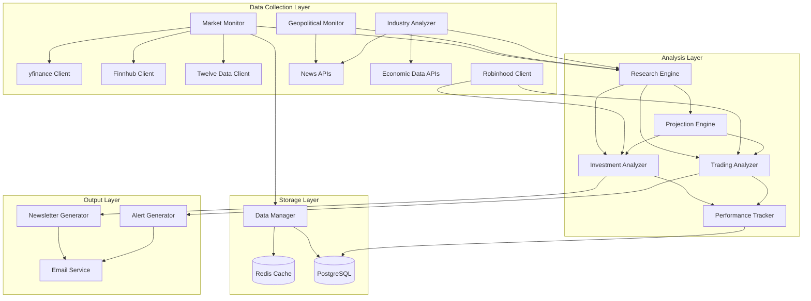
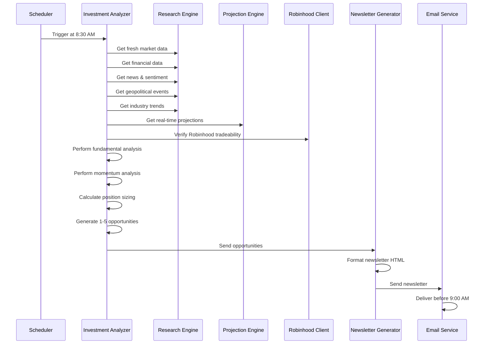
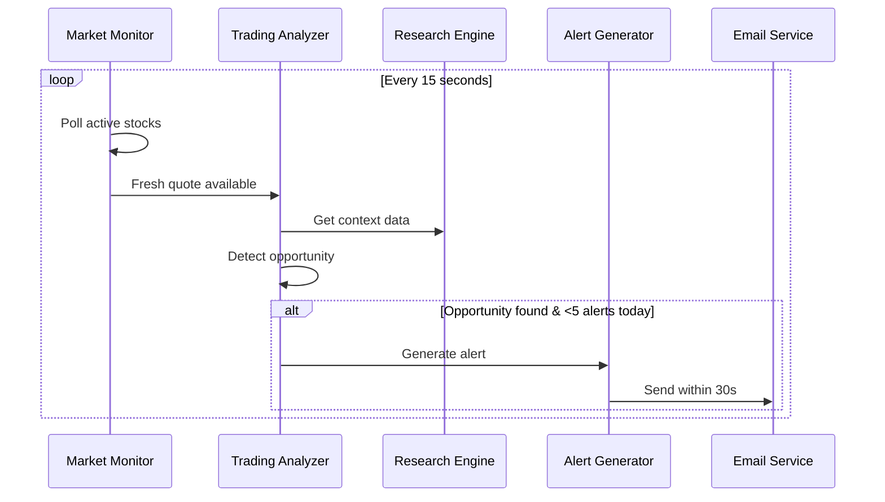

# Investment Scout Design Document

## Overview

Investment Scout is an automated market intelligence system that operates 24/7 to monitor global stock markets and deliver two types of recommendations: (1) PRIMARY: Daily investment newsletters at 9 AM with 1-5 highly selective long-term investment opportunities, and (2) SECONDARY: Real-time trading alerts for short-term buy/sell opportunities (max 5/day). The system is designed to run entirely on free hosting platforms with 512 MB RAM constraints, using only free-tier APIs and data sources.

The system architecture prioritizes:
- **Real-time data freshness**: All analysis uses only data with <30 second latency
- **Free-tier optimization**: Aggressive caching, rate limit management, and memory efficiency
- **Multi-source resilience**: Failover chains across multiple free data providers
- **Beginner-friendly output**: Clear explanations without assuming investment knowledge
- **Performance tracking**: Comprehensive benchmarking against S&P 500

### Key Design Principles

1. **Data Freshness First**: Reject stale data (>30s latency) from all analysis pipelines
2. **Free Tier Constraints**: Operate within 512 MB RAM, free API limits, and free hosting sleep cycles
3. **Failover Resilience**: Multiple data sources with automatic failover (yfinance → Finnhub → Twelve Data → cache)
4. **Dual TTL Caching**: 15s for active stocks, 60s for watchlist stocks
5. **Primary vs Secondary**: Investment opportunities (daily newsletter) take priority over trading alerts
6. **Global Market Coverage**: Monitor ALL accessible markets worldwide, not just US exchanges

## Architecture

### System Components



### Component Responsibilities

**Data Collection Layer**:
- **Market Monitor**: Polls market data continuously with dual TTL strategy (15s active, 60s watchlist)
- **Geopolitical Monitor**: Tracks political events, policy changes, conflicts, trade agreements
- **Industry Analyzer**: Monitors sector trends, competitive dynamics, regulatory changes
- **API Clients**: Interface with external data providers with rate limiting and failover

**Storage Layer**:
- **Data Manager**: Orchestrates Redis caching and PostgreSQL persistence
- **Redis Cache**: Hot data with TTL-based expiration (15s/60s)
- **PostgreSQL**: Historical data, financial statements, news, events, performance metrics

**Analysis Layer**:
- **Research Engine**: Aggregates and stores all research data (financials, news, events, trends)
- **Projection Engine**: Generates forward-looking projections with confidence intervals
- **Investment Analyzer**: PRIMARY function - generates 1-5 long-term opportunities daily
- **Trading Analyzer**: SECONDARY function - generates instant trading alerts (max 5/day)
- **Performance Tracker**: Monitors portfolio returns vs S&P 500 benchmark

**Output Layer**:
- **Newsletter Generator**: Creates daily 9 AM email with market overview and opportunities
- **Alert Generator**: Creates instant trading alert emails
- **Email Service**: Delivers emails via SendGrid free tier with retry logic

### Data Flow

#### Primary Flow: Daily Newsletter Generation



#### Secondary Flow: Real-Time Trading Alerts



### Free Tier Optimization Strategy

#### Memory Management (512 MB Constraint)

1. **Aggressive Cache Eviction**: Use Redis TTL to auto-expire old data
2. **Lazy Loading**: Load historical data only when needed for analysis
3. **Streaming Processing**: Process large datasets in chunks, not all at once
4. **Limited Watchlist**: Monitor top 100-200 stocks actively, rest on-demand
5. **Minimal Dependencies**: Use lightweight libraries where possible

#### API Rate Limit Management

| API Source | Free Tier Limit | Strategy |
|------------|----------------|----------|
| yfinance | Unlimited | Primary source for quotes and financials |
| Finnhub | 60 req/min | Secondary failover, prioritize news |
| Twelve Data | 8 req/min | Tertiary failover, technical indicators only |
| Robinhood | ~100 req/min | Cache tradeability results for 24h |
| SendGrid | 100 emails/day | 1 newsletter + max 5 alerts = 6/day |
| NewsAPI | 100 req/day | Batch fetch every 6 hours (4 requests/day) |
| FRED API | Unlimited | Economic indicators, daily updates |

#### Hosting Platform Handling

**Sleep Cycle Management** (Heroku/Render free tiers sleep after 30 min inactivity):
- Use external cron service (cron-job.org free tier) to ping every 25 minutes
- Implement fast wake-up: cache warm-up in <10 seconds
- Store critical state in PostgreSQL to survive restarts

**Resource Limits**:
- 512 MB RAM: Keep working set under 400 MB, reserve 112 MB for spikes
- CPU throttling: Batch operations, avoid tight loops
- Storage: Use free PostgreSQL tier (1 GB limit), rotate old data after 90 days

## Components and Interfaces

### Market Monitor

**Purpose**: Continuously poll market data from multiple sources with failover

**Interface**:
```python
class MarketMonitor:
    def start_monitoring(self, symbols: List[str]) -> None:
        """Start 24/7 monitoring for active symbols"""
    
    def stop_monitoring(self) -> None:
        """Stop monitoring"""
    
    def update_watchlist(self, symbols: List[str]) -> None:
        """Update watchlist symbols"""
    
    def get_current_price(self, symbol: str) -> Optional[Quote]:
        """Get current price with failover chain"""
    
    def poll_market_data(self) -> None:
        """Poll all monitored symbols"""
    
    def is_data_fresh(self, quote: Quote) -> bool:
        """Validate data latency <30 seconds"""
```

**Failover Chain**: yfinance → Finnhub → Twelve Data → Redis cache

**Polling Strategy**:
- Active stocks: Poll every 15 seconds
- Watchlist stocks: Poll every 60 seconds
- Reject any data with >30s latency
- Log all freshness violations

### Research Engine

**Purpose**: Centralized storage and retrieval of all research data

**Interface**:
```python
class ResearchEngine:
    def store_financial_data(self, symbol: str, data: FinancialData) -> None:
        """Store company financials"""
    
    def store_news_article(self, article: NewsArticle) -> None:
        """Store news with sentiment"""
    
    def store_geopolitical_event(self, event: GeopoliticalEvent) -> None:
        """Store geopolitical event"""
    
    def store_industry_trend(self, trend: IndustryTrend) -> None:
        """Store industry analysis"""
    
    def store_projection(self, projection: RealTimeProjection) -> None:
        """Store forward-looking projection"""
    
    def get_company_context(self, symbol: str, days: int = 30) -> CompanyContext:
        """Get comprehensive company context"""
    
    def get_market_sentiment(self, days: int = 7) -> MarketSentiment:
        """Get overall market sentiment"""
```

**Storage Schema** (PostgreSQL):
```sql
-- Financial data
CREATE TABLE financial_data (
    id SERIAL PRIMARY KEY,
    symbol VARCHAR(20) NOT NULL,
    revenue NUMERIC(20, 2),
    earnings NUMERIC(20, 2),
    pe_ratio NUMERIC(10, 2),
    debt_to_equity NUMERIC(10, 2),
    free_cash_flow NUMERIC(20, 2),
    roe NUMERIC(10, 4),
    updated_at TIMESTAMP NOT NULL,
    created_at TIMESTAMP DEFAULT CURRENT_TIMESTAMP
);

-- News articles
CREATE TABLE news_articles (
    id SERIAL PRIMARY KEY,
    title TEXT NOT NULL,
    summary TEXT,
    source VARCHAR(100),
    published_at TIMESTAMP NOT NULL,
    url TEXT,
    sentiment NUMERIC(3, 2),  -- -1.0 to 1.0
    symbols TEXT[],  -- Array of related symbols
    created_at TIMESTAMP DEFAULT CURRENT_TIMESTAMP
);

-- Geopolitical events
CREATE TABLE geopolitical_events (
    id SERIAL PRIMARY KEY,
    event_type VARCHAR(50) NOT NULL,  -- 'election', 'policy', 'conflict', 'trade', 'sanction'
    title TEXT NOT NULL,
    description TEXT,
    affected_regions TEXT[],
    affected_sectors TEXT[],
    impact_score NUMERIC(3, 2),  -- -1.0 to 1.0
    event_date TIMESTAMP NOT NULL,
    created_at TIMESTAMP DEFAULT CURRENT_TIMESTAMP
);

-- Industry trends
CREATE TABLE industry_trends (
    id SERIAL PRIMARY KEY,
    sector VARCHAR(100) NOT NULL,
    industry VARCHAR(100) NOT NULL,
    trend_type VARCHAR(50),  -- 'regulatory', 'technological', 'competitive', 'supply_chain'
    description TEXT,
    impact_score NUMERIC(3, 2),
    affected_companies TEXT[],
    timestamp TIMESTAMP NOT NULL,
    created_at TIMESTAMP DEFAULT CURRENT_TIMESTAMP
);

-- Real-time projections
CREATE TABLE projections (
    id SERIAL PRIMARY KEY,
    symbol VARCHAR(20) NOT NULL,
    projection_type VARCHAR(50),  -- 'revenue', 'earnings', 'price_target'
    projected_value NUMERIC(20, 2),
    confidence_lower NUMERIC(20, 2),
    confidence_upper NUMERIC(20, 2),
    confidence_level NUMERIC(3, 2),  -- 0.0 to 1.0
    projection_date TIMESTAMP NOT NULL,
    created_at TIMESTAMP DEFAULT CURRENT_TIMESTAMP
);
```

### Investment Analyzer (PRIMARY)

**Purpose**: Generate 1-5 high-quality long-term investment opportunities daily

**Interface**:
```python
class InvestmentAnalyzer:
    def analyze_opportunities(self) -> List[InvestmentOpportunity]:
        """Generate 1-5 daily opportunities"""
    
    def perform_fundamental_analysis(self, symbol: str) -> FundamentalScore:
        """Analyze financials: revenue, earnings, PE, debt, FCF, ROE"""
    
    def perform_momentum_analysis(self, symbol: str) -> MomentumScore:
        """Analyze price trends and volume patterns"""
    
    def build_global_context(self, symbol: str) -> GlobalContext:
        """Aggregate economic, geopolitical, industry, company context"""
    
    def calculate_position_size(self, risk_level: RiskLevel) -> Decimal:
        """Calculate position size 1-25% based on risk"""
    
    def verify_robinhood_tradeable(self, symbol: str) -> bool:
        """Verify security is tradeable on Robinhood"""
```

**Analysis Pipeline**:
1. **Screen Universe**: Filter to Robinhood-tradeable securities
2. **Fundamental Filter**: Revenue growth, positive earnings, reasonable PE, manageable debt
3. **Momentum Filter**: Positive price trend, increasing volume
4. **Context Enrichment**: Add geopolitical, industry, company-specific context
5. **Projection Integration**: Incorporate forward-looking projections
6. **Risk Assessment**: Assign LOW/MEDIUM/HIGH risk level
7. **Position Sizing**: Calculate 1-25% position based on risk and capital
8. **Ranking**: Score and rank all candidates
9. **Selection**: Pick top 1-5 opportunities
10. **Explanation**: Generate beginner-friendly thesis

**Scoring Formula**:
```
Opportunity Score = (Fundamental Score * 0.4) + 
                   (Momentum Score * 0.3) + 
                   (Context Score * 0.2) + 
                   (Projection Score * 0.1)

Where:
- Fundamental Score: Weighted average of revenue growth, earnings, PE, debt, FCF, ROE
- Momentum Score: Price trend strength + volume confirmation
- Context Score: Sentiment from news, geopolitical impact, industry trends
- Projection Score: Confidence-weighted expected return
```

### Trading Analyzer (SECONDARY)

**Purpose**: Generate instant trading alerts for short-term opportunities (max 5/day)

**Interface**:
```python
class TradingAnalyzer:
    def analyze_real_time(self, quote: Quote) -> Optional[TradingAlert]:
        """Analyze quote for trading opportunity"""
    
    def detect_buy_signal(self, symbol: str) -> Optional[TradingAlert]:
        """Detect buy opportunity"""
    
    def detect_sell_signal(self, symbol: str) -> Optional[TradingAlert]:
        """Detect sell opportunity"""
    
    def calculate_entry_exit(self, symbol: str) -> TradingLevels:
        """Calculate entry, target, stop loss"""
    
    def check_alert_limit(self) -> bool:
        """Ensure <5 alerts sent today"""
```

**Signal Detection**:
- **Buy Signals**: Breakout above resistance, oversold bounce, positive news catalyst
- **Sell Signals**: Breakdown below support, overbought reversal, negative news
- **Confirmation**: Require volume confirmation and fresh data (<30s)
- **Risk Management**: Always include stop loss and target price
- **Frequency Limit**: Max 5 alerts per day to prevent fatigue

### Geopolitical Monitor

**Purpose**: Track and analyze global political events impacting markets

**Interface**:
```python
class GeopoliticalMonitor:
    def collect_events(self) -> List[GeopoliticalEvent]:
        """Collect events from news sources"""
    
    def analyze_impact(self, event: GeopoliticalEvent) -> ImpactAnalysis:
        """Analyze market impact of event"""
    
    def get_affected_securities(self, event: GeopoliticalEvent) -> List[str]:
        """Identify affected stocks"""
    
    def calculate_impact_score(self, event: GeopoliticalEvent) -> float:
        """Score impact -1.0 to 1.0"""
```

**Event Types**:
- Elections and political transitions
- Policy changes (tax, regulation, trade)
- International conflicts and tensions
- Trade agreements and tariffs
- Sanctions and embargoes

**Data Sources**:
- News APIs (NewsAPI, RSS feeds) for event detection
- Sentiment analysis on event-related news
- Historical impact analysis from similar past events

### Industry Analyzer

**Purpose**: Monitor sector trends and competitive dynamics

**Interface**:
```python
class IndustryAnalyzer:
    def analyze_sector(self, sector: str) -> SectorAnalysis:
        """Analyze sector trends and outlook"""
    
    def analyze_competitive_position(self, symbol: str) -> CompetitiveAnalysis:
        """Analyze company's competitive position"""
    
    def detect_disruptions(self, industry: str) -> List[IndustryTrend]:
        """Detect technological or regulatory disruptions"""
    
    def identify_leaders(self, sector: str) -> List[str]:
        """Identify emerging leaders in sector"""
```

**Analysis Dimensions**:
- Competitive positioning and market share
- Regulatory environment changes
- Technological disruptions
- Supply chain dynamics
- Sector rotation trends

### Projection Engine

**Purpose**: Generate forward-looking projections with confidence intervals

**Interface**:
```python
class ProjectionEngine:
    def project_revenue(self, symbol: str) -> RealTimeProjection:
        """Project future revenue with confidence interval"""
    
    def project_earnings(self, symbol: str) -> RealTimeProjection:
        """Project future earnings with confidence interval"""
    
    def project_price_target(self, symbol: str) -> RealTimeProjection:
        """Project price target with confidence interval"""
    
    def update_projections(self) -> None:
        """Update all projections with latest data"""
```

**Projection Methodology**:
- Combine trend analysis with fundamental drivers
- Incorporate industry trends and geopolitical impacts
- Calculate confidence intervals based on data quality and volatility
- Update continuously as new data arrives
- NOT solely based on historical patterns

### Performance Tracker

**Purpose**: Monitor portfolio performance vs S&P 500 benchmark

**Interface**:
```python
class PerformanceTracker:
    def track_recommendation(self, opportunity: InvestmentOpportunity) -> None:
        """Start tracking a recommendation"""
    
    def update_positions(self) -> None:
        """Update all open position values"""
    
    def calculate_returns(self) -> PerformanceMetrics:
        """Calculate portfolio returns"""
    
    def compare_to_benchmark(self) -> BenchmarkComparison:
        """Compare to S&P 500"""
    
    def generate_attribution(self) -> AttributionAnalysis:
        """Analyze which opportunities contributed most"""
```

**Metrics Tracked**:
- Total return (absolute and percentage)
- Annualized return
- Sharpe ratio
- Maximum drawdown
- Win rate and average gain per winner
- Loss rate and average loss per loser
- Performance vs S&P 500 over same period

**Storage Schema**:
```sql
CREATE TABLE recommendations (
    id SERIAL PRIMARY KEY,
    symbol VARCHAR(20) NOT NULL,
    recommendation_type VARCHAR(20),  -- 'investment' or 'trading'
    entry_price NUMERIC(20, 6),
    entry_date TIMESTAMP NOT NULL,
    position_size_percent NUMERIC(5, 2),
    target_price NUMERIC(20, 6),
    stop_loss NUMERIC(20, 6),
    exit_price NUMERIC(20, 6),
    exit_date TIMESTAMP,
    status VARCHAR(20),  -- 'open', 'closed', 'stopped'
    return_percent NUMERIC(10, 4),
    created_at TIMESTAMP DEFAULT CURRENT_TIMESTAMP
);

CREATE TABLE performance_snapshots (
    id SERIAL PRIMARY KEY,
    snapshot_date DATE NOT NULL,
    portfolio_value NUMERIC(20, 2),
    total_return_percent NUMERIC(10, 4),
    sp500_return_percent NUMERIC(10, 4),
    relative_performance NUMERIC(10, 4),
    sharpe_ratio NUMERIC(10, 4),
    max_drawdown NUMERIC(10, 4),
    win_rate NUMERIC(5, 2),
    created_at TIMESTAMP DEFAULT CURRENT_TIMESTAMP
);
```

### Newsletter Generator

**Purpose**: Create daily email content from investment opportunities

**Interface**:
```python
class NewsletterGenerator:
    def generate_newsletter(self, opportunities: List[InvestmentOpportunity]) -> Newsletter:
        """Generate daily newsletter"""
    
    def format_html(self, newsletter: Newsletter) -> str:
        """Format newsletter as HTML"""
    
    def format_plain_text(self, newsletter: Newsletter) -> str:
        """Format newsletter as plain text"""
    
    def create_market_overview(self) -> str:
        """Create market overview section"""
```

**Newsletter Structure**:
```
Subject: Investment Scout Daily - [Date] - [N] Opportunities

[Market Overview]
- Current market conditions
- Key economic indicators
- Major geopolitical events
- Sector performance summary

[Investment Opportunities]
For each opportunity (1-5):
- Company name and symbol
- Current price and target price
- Investment thesis (beginner-friendly)
- Global context (economic, geopolitical, industry, company)
- Why now (timing rationale)
- Risk level and risk factors
- Expected return and holding period
- Position size recommendation

[Performance Update] (monthly)
- Portfolio return vs S&P 500
- Win rate and key metrics
- Top performing recommendations

[Footer]
- Disclaimer
- Unsubscribe link
```

### Alert Generator

**Purpose**: Create instant trading alert emails

**Interface**:
```python
class AlertGenerator:
    def generate_alert(self, alert: TradingAlert) -> str:
        """Generate alert email content"""
    
    def format_alert_html(self, alert: TradingAlert) -> str:
        """Format alert as HTML"""
    
    def format_alert_plain_text(self, alert: TradingAlert) -> str:
        """Format alert as plain text"""
```

**Alert Structure**:
```
Subject: 🚨 Trading Alert: [BUY/SELL] [Symbol] - [Company Name]

[Action]
BUY or SELL [Symbol] at [Current Price]

[Opportunity]
- Entry price: $X.XX
- Target price: $Y.YY (Expected gain: Z%)
- Stop loss: $W.WW (Max loss: -A%)
- Expected holding period: [timeframe]
- Position size: B% of portfolio

[Rationale]
[Beginner-friendly explanation of why this opportunity exists NOW]

[Context]
[Relevant news, events, or technical factors]

[Risk Factors]
[Key risks to be aware of]

[Disclaimer]
```

### Email Service

**Purpose**: Deliver emails via SendGrid with retry logic

**Interface**:
```python
class EmailService:
    def send_newsletter(self, newsletter: Newsletter, recipients: List[str]) -> bool:
        """Send newsletter email"""
    
    def send_alert(self, alert: TradingAlert, recipients: List[str]) -> bool:
        """Send trading alert email"""
    
    def send_with_retry(self, email: Email, max_retries: int = 3) -> bool:
        """Send email with exponential backoff retry"""
```

**Retry Strategy**:
- Initial attempt
- Retry 1: Wait 5 seconds
- Retry 2: Wait 15 seconds
- Retry 3: Wait 45 seconds
- Log failure if all retries exhausted

### Data Manager

**Purpose**: Orchestrate Redis caching and PostgreSQL persistence

**Interface**:
```python
class DataManager:
    def cache_quote(self, symbol: str, quote: Quote, is_active: bool) -> None:
        """Cache quote with appropriate TTL"""
    
    def get_cached_quote(self, symbol: str) -> Optional[Quote]:
        """Retrieve cached quote"""
    
    def store_historical_data(self, symbol: str, data_type: str, data: Dict) -> None:
        """Store historical data in PostgreSQL"""
    
    def get_historical_data(self, symbol: str, data_type: str, days: int) -> List[Dict]:
        """Retrieve historical data"""
    
    def is_cache_valid(self, symbol: str) -> bool:
        """Check if cached data is still valid"""
```

**Caching Strategy**:
- Active stocks: 15-second TTL
- Watchlist stocks: 60-second TTL
- Robinhood tradeability: 24-hour TTL
- Company info: 24-hour TTL
- Financial data: 6-hour TTL (updates quarterly)

## Data Models

### Core Data Types

```python
from dataclasses import dataclass
from datetime import datetime, timedelta
from decimal import Decimal
from enum import Enum
from typing import List, Optional

class RiskLevel(Enum):
    LOW = "low"
    MEDIUM = "medium"
    HIGH = "high"

class SignalType(Enum):
    BUY = "buy"
    SELL = "sell"

@dataclass
class Quote:
    symbol: str
    price: Decimal
    exchange_timestamp: datetime
    received_timestamp: datetime
    bid: Decimal
    ask: Decimal
    volume: int
    
    @property
    def latency(self) -> timedelta:
        return self.received_timestamp - self.exchange_timestamp
    
    @property
    def is_fresh(self) -> bool:
        return self.latency.total_seconds() < 30.0

@dataclass
class FinancialData:
    symbol: str
    revenue: Decimal
    earnings: Decimal
    pe_ratio: Decimal
    debt_to_equity: Decimal
    free_cash_flow: Decimal
    roe: Decimal
    updated_at: datetime

@dataclass
class NewsArticle:
    title: str
    summary: str
    source: str
    published_at: datetime
    url: str
    sentiment: Optional[float]  # -1.0 to 1.0

@dataclass
class GeopoliticalEvent:
    event_type: str  # 'election', 'policy', 'conflict', 'trade', 'sanction'
    title: str
    description: str
    affected_regions: List[str]
    affected_sectors: List[str]
    impact_score: float  # -1.0 to 1.0
    event_date: datetime

@dataclass
class IndustryTrend:
    sector: str
    industry: str
    trend_type: str  # 'regulatory', 'technological', 'competitive', 'supply_chain'
    description: str
    impact_score: float
    affected_companies: List[str]
    timestamp: datetime

@dataclass
class RealTimeProjection:
    symbol: str
    projection_type: str  # 'revenue', 'earnings', 'price_target'
    projected_value: Decimal
    confidence_lower: Decimal
    confidence_upper: Decimal
    confidence_level: float  # 0.0 to 1.0
    projection_date: datetime

@dataclass
class GlobalContext:
    economic_factors: List[str]
    geopolitical_events: List[str]
    industry_dynamics: List[str]
    company_specifics: List[str]
    timing_rationale: str
    risk_factors: List[str]

@dataclass
class InvestmentOpportunity:
    symbol: str
    company_name: str
    current_price: Decimal
    target_price: Decimal
    position_size_percent: Decimal  # 1-25%
    investment_thesis: str
    global_context: GlobalContext
    expected_return: Decimal
    risk_level: RiskLevel
    expected_holding_period: str
    data_timestamp: datetime

@dataclass
class TradingAlert:
    symbol: str
    company_name: str
    signal_type: SignalType
    current_price: Decimal
    entry_price: Decimal
    target_price: Decimal
    stop_loss: Decimal
    position_size_percent: Decimal
    rationale: str
    expected_holding_period: str
    data_timestamp: datetime

@dataclass
class Newsletter:
    date: datetime
    market_overview: str
    opportunities: List[InvestmentOpportunity]
    performance_summary: Optional[str]
    generated_at: datetime

@dataclass
class PerformanceMetrics:
    total_return_percent: Decimal
    annualized_return: Decimal
    sharpe_ratio: Decimal
    max_drawdown: Decimal
    win_rate: Decimal
    avg_gain_per_winner: Decimal
    loss_rate: Decimal
    avg_loss_per_loser: Decimal
    sp500_return_percent: Decimal
    relative_performance: Decimal
```


## Error Handling

### Error Categories and Strategies

**1. Network Errors (API Failures)**
- **Strategy**: Retry with exponential backoff (3 attempts)
- **Backoff**: 1s, 3s, 9s
- **Fallback**: Move to next provider in failover chain
- **Logging**: Log each failure with provider name and error details

**2. Rate Limit Errors**
- **Strategy**: Wait for rate limit reset time, then retry
- **Prevention**: Track request counts per provider, throttle proactively
- **Fallback**: Use alternative provider or cached data
- **Logging**: Log rate limit hits with timestamp and provider

**3. Data Freshness Violations**
- **Strategy**: Reject stale data, try next provider
- **Threshold**: 30 seconds latency
- **Fallback**: Continue down failover chain until fresh data found
- **Logging**: Log all freshness violations with symbol and latency

**4. Database Connection Errors**
- **Redis**: Attempt reconnect every 30 seconds, continue with degraded service
- **PostgreSQL**: Attempt reconnect every 30 seconds, queue writes in memory (max 1000)
- **Fallback**: Operate without persistence temporarily
- **Logging**: Log connection status changes

**5. Email Delivery Failures**
- **Strategy**: Retry 3 times with exponential backoff (5s, 15s, 45s)
- **Fallback**: Log failure for manual review
- **Alert**: Send system alert if newsletter fails to deliver
- **Logging**: Log all delivery attempts and final status

**6. Analysis Errors (Invalid Data)**
- **Strategy**: Skip invalid security, continue with others
- **Validation**: Check for null values, negative prices, extreme outliers
- **Fallback**: Use last known good data if available
- **Logging**: Log validation failures with symbol and reason

**7. Memory Pressure (512 MB Limit)**
- **Strategy**: Aggressive garbage collection, cache eviction
- **Monitoring**: Track memory usage, trigger cleanup at 400 MB
- **Fallback**: Reduce watchlist size, process in smaller batches
- **Logging**: Log memory warnings and cleanup actions

### Error Recovery Patterns

**Circuit Breaker Pattern** (for API clients):
```python
class CircuitBreaker:
    def __init__(self, failure_threshold: int = 5, timeout: int = 60):
        self.failure_count = 0
        self.failure_threshold = failure_threshold
        self.timeout = timeout
        self.last_failure_time = None
        self.state = "closed"  # closed, open, half_open
    
    def call(self, func, *args, **kwargs):
        if self.state == "open":
            if time.time() - self.last_failure_time > self.timeout:
                self.state = "half_open"
            else:
                raise CircuitBreakerOpen()
        
        try:
            result = func(*args, **kwargs)
            if self.state == "half_open":
                self.state = "closed"
                self.failure_count = 0
            return result
        except Exception as e:
            self.failure_count += 1
            self.last_failure_time = time.time()
            if self.failure_count >= self.failure_threshold:
                self.state = "open"
            raise
```

**Graceful Degradation**:
- If all data sources fail: Use cached data with staleness warning
- If analysis fails: Send newsletter with market overview only
- If email fails: Store newsletter in database for manual delivery
- If performance tracking fails: Continue recommendations without metrics

### Logging Strategy

**Log Levels**:
- **DEBUG**: Detailed flow information (cache hits, API calls)
- **INFO**: Normal operations (monitoring started, newsletter sent)
- **WARNING**: Recoverable issues (rate limits, stale data, fallbacks)
- **ERROR**: Failures requiring attention (API failures, database errors)
- **CRITICAL**: System-level failures (startup failures, unrecoverable errors)

**Structured Logging Format**:
```json
{
    "timestamp": "2024-01-15T08:30:45.123Z",
    "level": "WARNING",
    "component": "MarketMonitor",
    "event": "stale_data_detected",
    "symbol": "AAPL",
    "latency_seconds": 45.2,
    "provider": "finnhub",
    "message": "Stale data detected for AAPL from finnhub"
}
```

**Critical Events to Log**:
- Component startup/shutdown
- All API requests (provider, endpoint, status, latency)
- Data freshness violations
- Failover events
- Newsletter generation and delivery
- Trading alert generation and delivery
- Performance metric updates
- Database connection status changes
- Memory usage warnings
- All errors with full stack traces

## Testing Strategy

### Dual Testing Approach

The system requires both unit tests and property-based tests for comprehensive coverage:

**Unit Tests**: Verify specific examples, edge cases, and error conditions
**Property Tests**: Verify universal properties across all inputs

Together, these approaches provide comprehensive coverage where unit tests catch concrete bugs and property tests verify general correctness.

### Unit Testing

**Test Coverage Areas**:

1. **Data Freshness Validation**
   - Test Quote.is_fresh with various latencies
   - Test rejection of stale data (>30s)
   - Test edge case at exactly 30s boundary

2. **Failover Chain**
   - Test successful primary provider (yfinance)
   - Test fallback to Finnhub when yfinance fails
   - Test fallback to Twelve Data when both fail
   - Test cache fallback when all APIs fail
   - Test complete failure scenario

3. **Rate Limiting**
   - Test rate limit detection
   - Test throttling behavior
   - Test rate limit reset handling

4. **Caching Strategy**
   - Test 15s TTL for active stocks
   - Test 60s TTL for watchlist stocks
   - Test cache invalidation
   - Test cache miss handling

5. **Email Delivery**
   - Test successful delivery
   - Test retry logic with exponential backoff
   - Test failure after max retries

6. **Position Sizing**
   - Test LOW risk → 15-25% position
   - Test MEDIUM risk → 8-15% position
   - Test HIGH risk → 1-8% position

7. **Alert Frequency Limiting**
   - Test max 5 alerts per day
   - Test alert suppression after limit reached

8. **Performance Tracking**
   - Test return calculation
   - Test S&P 500 comparison
   - Test win/loss rate calculation

### Property-Based Testing

**Configuration**:
- Library: Hypothesis (Python)
- Minimum iterations: 100 per property
- Tag format: `# Feature: investment-scout, Property {N}: {description}`

**Properties to Test** (will be defined in Correctness Properties section):
- Data freshness properties
- Caching behavior properties
- Failover chain properties
- Position sizing properties
- Alert frequency properties
- Performance calculation properties
- Newsletter generation properties

### Integration Testing

**Test Scenarios**:

1. **End-to-End Newsletter Generation**
   - Start with empty database
   - Collect market data
   - Generate opportunities
   - Create newsletter
   - Verify email delivery

2. **Real-Time Alert Flow**
   - Monitor active stocks
   - Detect opportunity
   - Generate alert
   - Verify delivery within 30s

3. **Multi-Provider Failover**
   - Simulate yfinance failure
   - Verify Finnhub fallback
   - Verify data freshness maintained

4. **Database Persistence**
   - Store quotes, news, events
   - Retrieve historical data
   - Verify data integrity

5. **Performance Tracking**
   - Track multiple recommendations
   - Update positions
   - Calculate metrics
   - Compare to benchmark

### Test Data Strategy

**Mock Data**:
- Use realistic stock symbols (AAPL, MSFT, GOOGL)
- Generate realistic price ranges
- Create realistic timestamps with controlled latency
- Mock API responses with actual response structures

**Property Test Generators**:
```python
from hypothesis import strategies as st

# Generate valid stock symbols
symbols = st.text(min_size=1, max_size=5, alphabet=st.characters(whitelist_categories=('Lu',)))

# Generate realistic prices
prices = st.decimals(min_value=Decimal('0.01'), max_value=Decimal('10000.00'), places=2)

# Generate timestamps with controlled latency
def timestamp_with_latency(latency_seconds):
    now = datetime.now()
    exchange_time = now - timedelta(seconds=latency_seconds)
    return exchange_time, now

# Generate quotes with various latencies
fresh_quotes = st.builds(
    Quote,
    symbol=symbols,
    price=prices,
    exchange_timestamp=st.datetimes(),
    received_timestamp=st.datetimes(),
    bid=prices,
    ask=prices,
    volume=st.integers(min_value=0, max_value=1000000000)
).filter(lambda q: q.is_fresh)

stale_quotes = st.builds(
    Quote,
    symbol=symbols,
    price=prices,
    exchange_timestamp=st.datetimes(),
    received_timestamp=st.datetimes(),
    bid=prices,
    ask=prices,
    volume=st.integers(min_value=0, max_value=1000000000)
).filter(lambda q: not q.is_fresh)
```

### Performance Testing

**Memory Profiling**:
- Monitor memory usage during operation
- Verify staying under 400 MB working set
- Test cache eviction under memory pressure

**API Rate Limit Testing**:
- Verify staying within free tier limits
- Test throttling effectiveness
- Measure API call distribution

**Latency Testing**:
- Measure newsletter generation time (target: <30s)
- Measure alert generation time (target: <10s)
- Measure data collection latency

## Correctness Properties

*A property is a characteristic or behavior that should hold true across all valid executions of a system-essentially, a formal statement about what the system should do. Properties serve as the bridge between human-readable specifications and machine-verifiable correctness guarantees.*

### Property 1: Data Timestamp Recording

*For any* market data received by the Market_Monitor, the resulting Quote object SHALL contain both a valid exchange_timestamp and a valid received_timestamp.

**Validates: Requirements 1.4**

### Property 2: Latency Calculation Correctness

*For any* Quote object, the calculated latency SHALL equal the difference between received_timestamp and exchange_timestamp.

**Validates: Requirements 1.5**

### Property 3: Stale Data Flagging

*For any* Quote object where the latency exceeds 30 seconds, the is_fresh property SHALL return False, and for any Quote where latency is 30 seconds or less, is_fresh SHALL return True.

**Validates: Requirements 1.6**

### Property 4: Fresh Data Usage in Analysis

*For any* analysis operation (Investment_Analyzer or Trading_Analyzer), all Quote data used SHALL have is_fresh = True, and any Quote with is_fresh = False SHALL be rejected.

**Validates: Requirements 1.7, 4.5, 12.8**

### Property 5: Dual TTL Caching Strategy

*For any* cached Quote, if the symbol is classified as Active_Stock, the cache TTL SHALL be 15 seconds, and if classified as Watchlist_Stock, the cache TTL SHALL be 60 seconds.

**Validates: Requirements 1.8, 7.2, 7.3**

### Property 6: Rate Limit Compliance

*For any* API_Client over any time window, the number of requests SHALL NOT exceed the free tier rate limit for that provider.

**Validates: Requirements 2.5**

### Property 7: Robinhood Tradeability Filtering

*For any* security evaluated for recommendation, the security SHALL be verified as Robinhood_Tradeable, and any security that is not Robinhood_Tradeable SHALL be excluded from all recommendations.

**Validates: Requirements 3.1, 3.2**

### Property 8: Position Size Range Constraint

*For any* Investment_Opportunity or Trading_Alert, the Position_Size recommendation SHALL be between 1% and 25% inclusive of the portfolio.

**Validates: Requirements 4.8**

### Property 9: Newsletter Opportunity Count

*For any* Newsletter generated, the number of Investment_Opportunity recommendations SHALL be between 1 and 5 inclusive.

**Validates: Requirements 5.4**

### Property 10: Retry with Exponential Backoff

*For any* failed operation (API request or email delivery), the system SHALL retry exactly 3 times with exponential backoff delays before marking the operation as failed.

**Validates: Requirements 6.5, 10.1**

### Property 11: Cache Freshness Validation

*For any* cached data retrieval, if the cache entry has exceeded its TTL, the Data_Manager SHALL NOT return the cached data and SHALL fetch fresh data instead.

**Validates: Requirements 7.6**

### Property 12: Sentiment Score Range

*For any* news article processed by the Research_Engine, the calculated sentiment score SHALL be between -1.0 and 1.0 inclusive.

**Validates: Requirements 8.9**

### Property 13: Rate Limit Error Handling

*For any* API_Client that encounters a rate limit error, the system SHALL wait until the rate limit reset time before retrying the request.

**Validates: Requirements 10.2**

### Property 14: Trading Alert Generation Timing

*For any* detected trading opportunity (buy or sell), the Trading_Analyzer SHALL generate a Trading_Alert within 10 seconds of detection.

**Validates: Requirements 12.2, 12.3**

### Property 15: Trading Alert Delivery Timing

*For any* Trading_Alert generated, the Email_Service SHALL send the alert email within 30 seconds of the alert generation.

**Validates: Requirements 12.5**

### Property 16: Trading Alert Frequency Limit

*For any* 24-hour period, the Trading_Analyzer SHALL generate no more than 3 Trading_Alert messages.

**Validates: Requirements 12.10**

### Property 17: Geopolitical Impact Score Range

*For any* Geopolitical_Event processed by the Geopolitical_Monitor, the assigned impact_score SHALL be between -1.0 and 1.0 inclusive.

**Validates: Requirements 13.4**

### Property 18: Projection Confidence Intervals

*For any* Real_Time_Projection generated by the Projection_Engine, the projection SHALL include valid confidence_lower and confidence_upper values where confidence_lower ≤ projected_value ≤ confidence_upper.

**Validates: Requirements 15.4**

### Property 19: Configuration Validation at Startup

*For any* system startup, all required configuration values SHALL be validated, and if any configuration value is invalid, the system SHALL fail startup with a descriptive error message.

**Validates: Requirements 16.8, 16.9**

### Property 20: Performance Tracking Completeness

*For any* Investment_Opportunity recommended, the Performance_Tracker SHALL create a tracking record with entry_price, entry_date, and status, and SHALL update the record when the position is closed.

**Validates: Requirements 17.1**

### Property 21: Portfolio Return Calculation

*For any* set of tracked recommendations, the calculated cumulative portfolio return SHALL equal the weighted sum of individual returns based on their Position_Size percentages.

**Validates: Requirements 17.2**

### Property 22: Memory Usage Constraint

*For any* point during system operation, the total memory usage SHALL remain below 512 MB.

**Validates: Requirements 18.5**

### Property 23: API Failover Chain

*For any* data request where the primary API source is unavailable, the system SHALL automatically fall back to the next available alternative source in the failover chain.

**Validates: Requirements 19.6**

